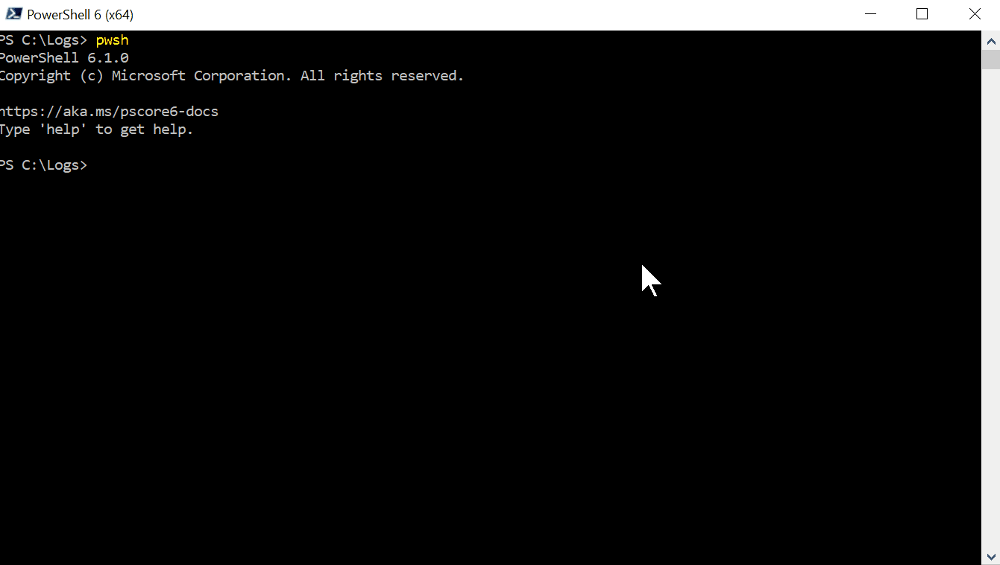
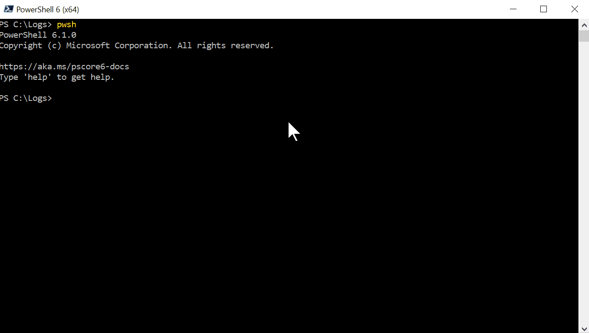

# Sanitization PowerShell Module

## PowerShell module to perform sanitization of sensitive information on a document or a string.

This module helps you replace the sensitive information within a document (or a string) with trash data,  
which also gives you to option to keep the document consistent.  

As an example it can be useful when a vendor requires log from a software that is processing classified or sensitive information.  
Before handing over the log to the vendor, use this module to redact the sensitive information but with consistency kept in tact so the vendor hopefully could still identify a pattern of a problem and help you.  

| Build Status | Latest Published Version |
| --- | --- |
| [](https://ci.appveyor.com/project/DCAG/sanitization) | [](https://www.powershellgallery.com/packages/Sanitization/)

---

## Installation

### Prerequisits

- Make sure that the computer or server you are going to run this script on has PowerShell version 5.1 or PowerShell Core installed.

### On computer with an internet connection

```powershell
Install-Module Sanitization -Scope UserProfile
```

### On computer without an internet connection

1. Go to a Computer with internet connection and save the module to the local disk

    ```powershell
    Save-Module Sanitization -Path "$env:userprofile\Desktop"
    ```

2. With a disk on key or any other means copy the module directory to the computer without an internet connection and paste it in the directory C:\Program Files\WindowsPowerShell\Modules\ .

---

## Examples

- Jump to: [Invoke-Redaction](#Example-1) examples.
- Jump to: [Invoke-FileRedaction](#Example-11) examples.
- More examples in the [module help](docs/reference/functions).

### Example 1

```powershell
'Apple, Lemon, Menta' | Invoke-Redaction -RedactionRule @(
    New-RedactionRule -Pattern 'Lemon' -NewValueString 'Beet'
)
```

Output:

```text
Apple, Beet, Menta
```

Simple replace literal value with another literal value.

### Example 2

```powershell
@(
'Apple, Waffle, Menta'
'Apple, Oreo, Menta'
) | Invoke-Redaction -RedactionRule @(
    New-RedactionRule -Pattern 'Apple' -NewValueString 'Banana'
    New-RedactionRule -Pattern '(?<=, )\w+(?=,)' -NewValueString 'Sweets'
)
```

Output:

```text
Banana, Sweets, Menta
Banana, Sweets, Menta
```

Two redaction rules, first rule is a literal value replace and second is replace with regex pattern.

### Example 3

```powershell
@(
'Apple, Waffle, Menta'
'Apple, Oreo, Menta'
) | Invoke-Redaction -RedactionRule @(
    New-RedactionRule -Pattern 'Apple' -NewValueString 'Banana'
    New-RedactionRule -Pattern '(?<=, )\w+(?=,)' -NewValueString 'Sweet_{0}'
)
```

Output:

```text
Banana, Sweet_0, Menta
Banana, Sweet_1, Menta
```

The second redaction rule is looking to replace, based on regex pattern, the middle word in the input strings
with a new generated value. Generated in a way that the place holder '{0}' is replaced with the line number.

### Example 4

```powershell
@(
'Apple, Waffle, Menta'
'Apple, Oreo, Menta'
) | Invoke-Redaction -RedactionRule @(
    New-RedactionRule -Pattern 'Apple' -NewValueString 'Banana'
    New-RedactionRule -Pattern '(?<=, )\w+(?=,)' -NewValueString 'Sweet_{0}'
    New-RedactionRule -Pattern '(?<=, )\w+$' -NewValueFunction {
        [Guid]::NewGuid().Guid
    }
)
```

Output:

```text
Banana, Sweet_0, 82b513b7-9f82-4071-9a0d-60c439dc4d56
Banana, Sweet_1, 244a22bc-9f84-44aa-bf12-f5522e93a130
```

The third redaction rule is replacing the last word in each input line with a generated value.
This generated value is result of new guid function.  
See [New-RedactionRule](docs/reference/functions/New-RedactionRule.md#EXAMPLES) documentation for more advanced examples of function as new value generation option in a redaction rule.

### Example 5

```powershell
@(
'Apple, Waffle'
'Apple, Oreo'
) | Invoke-Redaction -RedactionRule @(
    New-RedactionRule -Pattern '[^\s,]+' -NewValueString 'A_{0}'
)
```

Output:

```text
A_0, A_0
A_1, A_1
```

The redaction rule is looking to replace, based on regex pattern all the words between two commas in the input strings with a new generated value. Generated in a way that the place holder '{0}' is replaced with the **line number**.

### Example 6

```powershell
@(
'Apple, Waffle'
'Apple, Oreo'
) | Invoke-Redaction -Consistent -RedactionRule @(
    New-RedactionRule -Pattern '[^\s,]+' -NewValueString 'A_{0}'
)
```

Output:

```text
A_1, A_0
A_1, A_2
```

The redaction rule is looking to replace, based on regex pattern all the words between two commas in the input strings with a new generated value.
Because `-Consistent` switch was added the new value is generated in a way that the place holder '{0}' is replaced with a **uniquness factor** instead of line number.
Uniqueness factor starts at 0 and increased with each unique value that is found.

In this example, 3 unique values were found and replaced: 'Apple', 'Waffle' and 'Oreo'.  

**The process of replacement is as follows**:  
'Waffle' was replaced first so it got the uniqueness value of 0 (new value: 'A_0').  
The uniqueness value was increased by 1.  
'Apple' was replaced second so it got the uniqueness value of 1 (new value: 'A_1').  
Again, the uniqueness value was increased by 1.  
'Oreo' was replaced third so it got the uniqueness value of 2 (new value: 'A_2').  
Again, the uniqueness value was increased by 1.  
When 'Apple' was found again it was replaced with the value that was assigned to 'Apple' before, to keep on consistency.

### Example 7

```powershell
$Lines = @(
'Apple, Waffle'
'Apple, Oreo'
)

$RedactionRule = @(
    New-RedactionRule -Pattern '[^\s,]+' -NewValueString 'A_{0}'
)

$Lines | Invoke-Redaction -RedactionRule $RedactionRule -Consistent -OutConversionTable 'Table'

# Print the conversion table
$Table
```

Output:

```text
A_1, A_0
A_1, A_2

Name                           Value
----                           -----
Waffle                         A_0
Apple                          A_1
Oreo                           A_2
```

Although the arragement is different, this example is the same as the previous one ([Example 6](#Example-6)) with the addition of `-OutConversionTable 'Table'`.  
`-OutConversionTable` is a Dynamic parameter that is available only when the `-Consistent` switch is true.  
New variable `$Table` is created with the hash table used internally as its value.  
It lets us inspect what values were replaced and which new values replced them.

### Example 8

The order of redaction rules is important.

```powershell
@(
'Apple, Waffle, Menta, Banana'
'Apple, Oreo, Menta, Banana'
) | Invoke-Redaction -RedactionRule @(
    New-RedactionRule -Pattern 'Apple' -NewValueString 'Banana'
    New-RedactionRule -Pattern 'Banana' -NewValueString 'Kiwi'
)
```

After the 1st rule is processed, 'Apple' is replaced with 'Banana'.

```text
Banana, Waffle, Menta, Banana
Banana, Oreo, Menta, Banana
```

Then 'Banana' is replaced with 'Kiwi'.

Output:

```text
Kiwi, Waffle, Menta, Kiwi
Kiwi, Oreo, Menta, Kiwi
```

Transitive replacement happened (Apple->Banana->Kiwi => Apple->Kiwi).

If the order of rules is switched it has different result, as seen here:

```powershell
@(
'Apple, Waffle, Menta, Banana'
'Apple, Oreo, Menta, Banana'
) | Invoke-Redaction -RedactionRule @(
    New-RedactionRule -Pattern 'Banana' -NewValueString 'Kiwi'
    New-RedactionRule -Pattern 'Apple' -NewValueString 'Banana'
)
```

Output:

```text
Banana, Waffle, Menta, Kiwi
Banana, Oreo, Menta, Kiwi
```

### Example 9

```powershell
@(
'Apple, Waffle, Menta, Banana'
'Apple, Oreo, Waffle, Banana'
'Apple - Menta - Banana'
) | Invoke-Redaction -AsObject -RedactionRule @(
    New-RedactionRule -Pattern '(?<=^|, )\w+?(?=,|$)' -NewValueString 'Food_{0}'
) | Format-Table -AutoSize
```

Output:

```text
LineNumber CurrentString                  Original                     Changed
---------- -------------                  --------                     -------
         0 Food_0, Food_0, Food_0, Food_0 Apple, Waffle, Menta, Banana    True
         1 Food_1, Food_1, Food_1, Food_1 Apple, Oreo, Waffle, Banana     True
         2 Apple - Menta - Banana         Apple - Menta - Banana         False
```

This is the output when `-AsObject` switch is used.

### Example 10

```powershell
@(
'Apple, Waffle, Menta, Banana'
'Apple, Oreo, Waffle, Banana'
'Apple - Menta - Banana'
) | Invoke-Redaction -AsObject -Consistent -RedactionRule @(
    New-RedactionRule -Pattern '(?<=^|, )\w+?(?=,|$)' -NewValueString 'Food_{0}'
) | Format-Table -AutoSize
```

Output:

```text
LineNumber CurrentString                  Original                     Changed Uniqueness
---------- -------------                  --------                     ------- ----------
         0 Food_3, Food_2, Food_1, Food_0 Apple, Waffle, Menta, Banana    True          4
         1 Food_3, Food_4, Food_2, Food_0 Apple, Oreo, Waffle, Banana     True          5
         2 Apple - Menta - Banana         Apple - Menta - Banana         False          5
```

This is the output when `-AsObject` switch is used with `-Consistent` switch.  
See [Example 6](#Example-6) for explanation on Uniqueness value.

### Example 11

```powershell
$LogFile = "WULog.log"
Invoke-FileRedaction -Path $LogFile -RedactionRule @(
        New-RedactionRule -Pattern '\b[0-9A-F]{8}(-[0-9A-F]{4}){3}-[0-9A-F]{12}\b' -NewValueFunction {
                [Guid]::NewGuid().Guid
        }
        New-RedactionRule -Pattern '(?<=\d{2}:\d{2}:\d{2}\.\d{7}\s+\d+\s+\d+\s+)[^\s]+?(?=\s{1,})' -NewValueString "Component_{0}"
        New-RedactionRule -Pattern '(?<=PN=)[^\s;]+?(?=;|\s|$|\n)' -NewValueString "Product_{0}"
        New-RedactionRule -Pattern '(?<=(E:|\?)[^\s]*\=)[^\s&=]+?(?=&|\s|$|\n)' -NewValueString "UriParam_{0}"
        New-RedactionRule -Pattern '(?-i)Microsoft\.com' -NewValueString "Contoso.co.au"
        New-RedactionRule -Pattern 'microsoft\.com' -NewValueString "contoso.co.au"
        New-RedactionRule -Pattern '(?-i)Microsoft' -NewValueString "Contoso"
        New-RedactionRule -Pattern 'microsoft' -NewValueString "contoso"
        New-RedactionRule -Pattern 'Dell' -NewValueString "Msi"
        New-RedactionRule -Pattern '(?<=\((cV: |cV = ))[^\s]+?(?=(\.\d+){1,}\))' -NewValueString 'cV_{0}'
        New-RedactionRule -Pattern '(?<=Destaging package )[^\s]*?(?=\s|$|\n)' -NewValueString 'DestagingPackage_{0}'
        New-RedactionRule -Pattern '(?<=IntentPFaNs = )[^\s]*?(?=\s|$|\n)' -NewValueString 'PFaNs_{0}'
        New-RedactionRule -Pattern '(?<=Title = ).+?(?=$|\n)' -NewValueString 'ApplicationSet_{0}'
        New-RedactionRule -Pattern '(?<=Non-required installable package \().+(?=\) found!)' -NewValueString 'Package_{0}'
        New-RedactionRule -Pattern 'S-1-5-21-\d{10}-\d{10}-\d{10}-1001' -NewValueFunction {                
                $Group1 = -join (1..10 | ForEach-Object{0..9 | Get-Random})
                $Group2 = -join (1..10 | ForEach-Object{0..9 | Get-Random})
                $Group3 = -join (1..10 | ForEach-Object{0..9 | Get-Random})
                'S-1-5-21-{0}-{1}-{2}-1001' -f $Group1,$Group2,$Group3
        }
)
```

Output:

```text
Original          Sanitized                       ConversionTable
--------          ---------                       ---------------
C:\Logs\WULog.log C:\Logs\WULog.log-Sanitized.txt C:\Logs\WULog.log-ConversionTable.csv
```

In this example I'm performing sanitization to Windows Update log with a large and complicated set of rules.  
I've inspected the file, found strings and patterns I would like to redact from it and composed the redaction rules.  
Once file has been processed, 2 new were created: sanitized text file and the conversion-table csv file.  
The log has more than 5,000 lines, the processing took 15 seconds in PowerShell core.  
FYI: In Windows PowerShell (5.1) it takes 1 minute and 15 seconds.  
I've used a lot of regular expression patterns and tools:

- Positive look ahead `(?=abc)`
- Positive look behind `(?<=abc)`
- Case insenstive `(?-i)`
- Word Boundaries `'\bword\b'`

Inspect the script and the input and output files [here](docs/examples/11).



### Example 12

```powershell
$LogFile = "WULog.log"
Invoke-FileRedaction -Path $LogFile -ReadRaw -RedactionRule @(
        New-RedactionRule -Pattern '\b[0-9A-F]{8}(-[0-9A-F]{4}){3}-[0-9A-F]{12}\b' -NewValueFunction {
                [Guid]::NewGuid().Guid
        }
        New-RedactionRule -Pattern '(?<=\d{2}:\d{2}:\d{2}\.\d{7}\s+\d+\s+\d+\s+)[^\s]+?(?=\s{1,})' -NewValueString "Component_{0}"
        New-RedactionRule -Pattern '(?<=PN=)[^\s;]+?(?=;|\s|$|\n)' -NewValueString "Product_{0}"
        New-RedactionRule -Pattern '(?<=(E:|\?)[^\s]*\=)[^\s&=]+?(?=&|\s|$|\n)' -NewValueString "UriParam_{0}"
        ...
        ...
)
```

Same script as previous example but with `-ReadRaw` paramter.  
`-ReadRaw` reads the input text file as one single string instead of an array of lines.  
Each of the redaction rules is being applied on the entire file before proceeding to the apply the next rule. This is as opposed to applying all the rules line after line.  
In this example, processing the log took less than 5 seconds, on PowerShell Core as well as on Windows PowerShell 5.1.  

Inspect the script and the input and output files [here](docs/examples/12).


