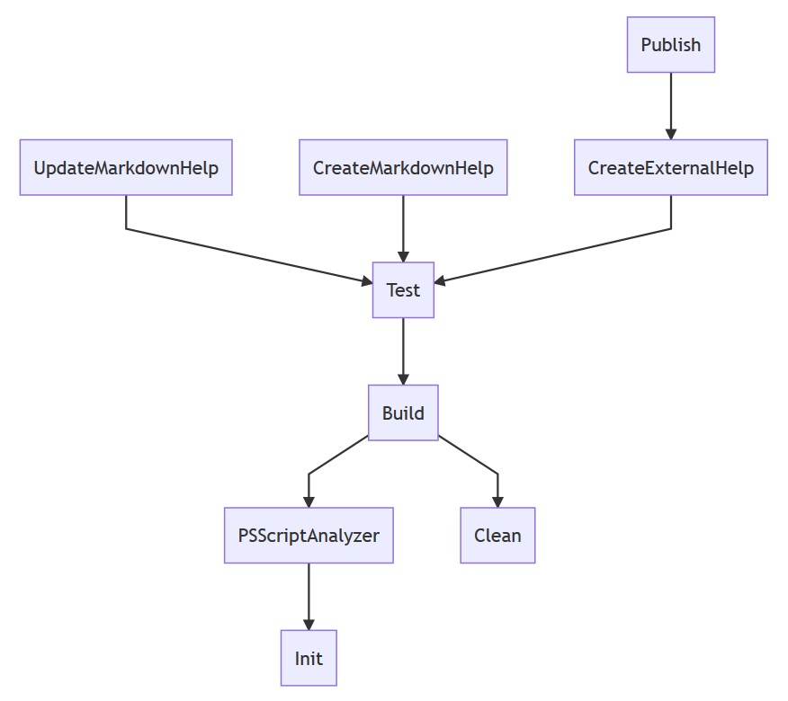
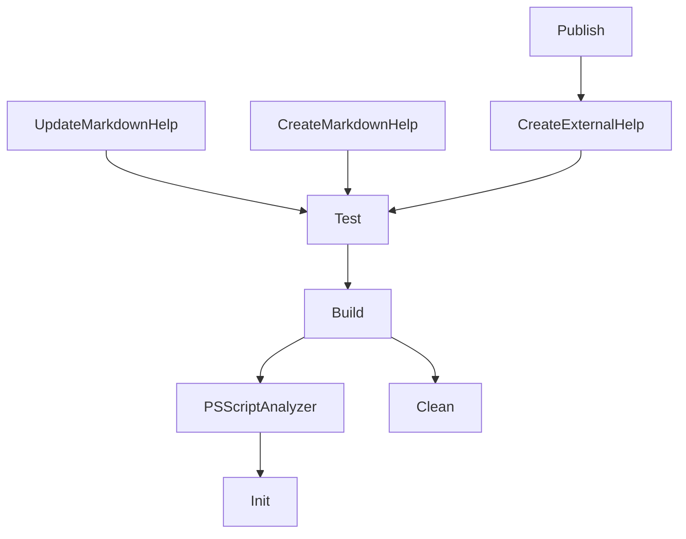

# Build Flow

Generated with [mermaid (https://mermaidjs.github.io/)](https://mermaidjs.github.io/).

```mermaid
graph TD;
    D[UpdateMarkdownHelp]-->C
    E[CreateMarkdownHelp]-->C
    A[Publish]-->B[CreateExternalHelp]
    B-->C[Test]
    C-->F[Build]
    F-->G[PSScriptAnalyzer]
    F-->H[Clean]
    G-->I[Init]
```